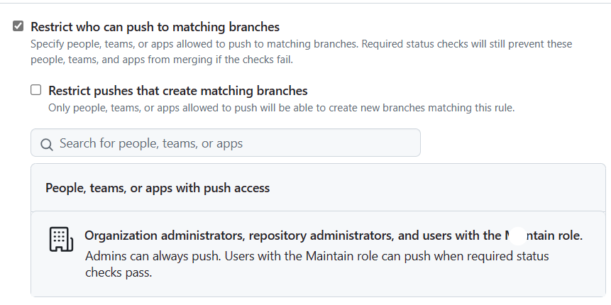
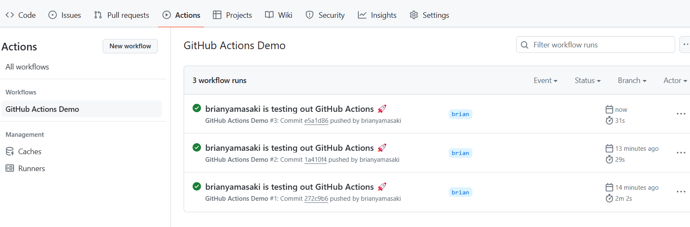
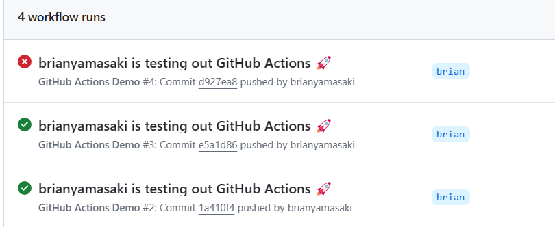

# Test Repository for Github Actions

## How to stop pushing into the Main or Master branch

For each repository, we go to the settings tab on Github and click on the "Branch" item on the left side of the page and create a "Branch Protection Rule" as shown below 

The "Require a pull request before merging" seems like the obvious pace to start.

Turns out we need to "Restrict who can push to matching branches." 

This setting still allows administrators to do pushes directly to the main branch, though.

More details about the options chosen on the page above is available at this [manual page](https://docs.github.com/en/repositories/configuring-branches-and-merges-in-your-repository/managing-protected-branches/about-protected-branches).

## Running Continuous Integration testing on push

We'll start with the information on [this page](https://docs.github.com/en/actions/learn-github-actions/understanding-github-actions).

1. We'll create the folders ```.github/workflows``` at the root of the project and create a YML file. 

2. When we push into your branch, the actions are run. 

3. The results of the test are stored in the Actions tab in the Github website for this repository. It can take a minute or two, since Github spins up a fresh version of Windows, copies over the files to that server, then fires off the testing.


4. Test Failures are shown by visiting the Actions tab 

5. Unfortunately, pull requests are still possible to make, even after you fail the test run
