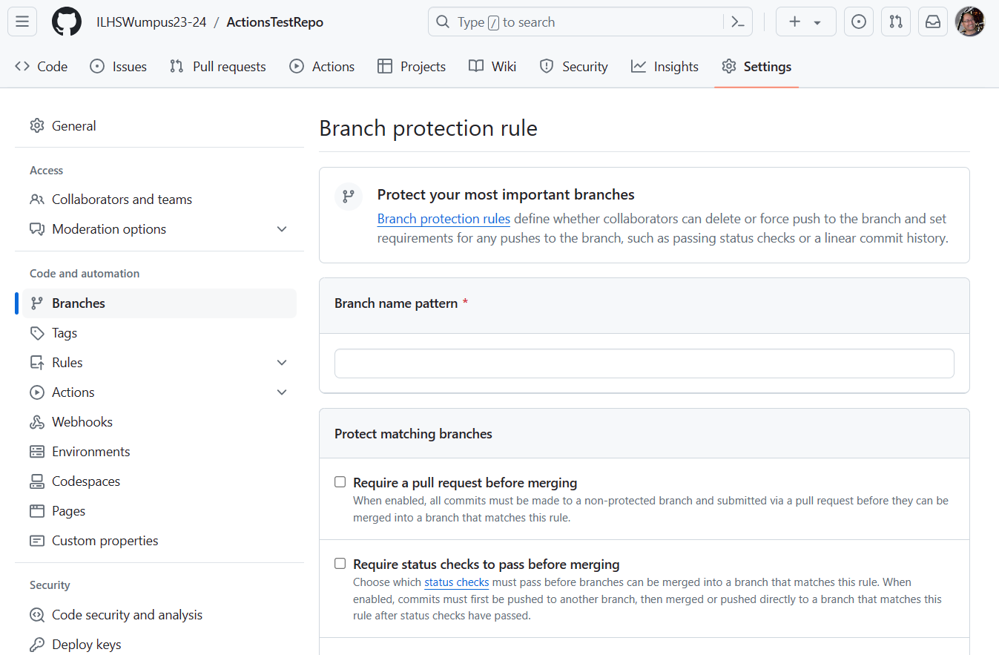

# Test Repository for Github Actions

## How to stop pushing into the Main or Master branch

For each repository, we go to the settings tab on Github and click on the "Branch" item on the left side of the page and create a "Branch Protection Rule" as shown below 

The "Require a pull request before merging" seems like the obvious pace to start.

More details about the options chosen on the page above is available at this [manaul page](https://docs.github.com/en/repositories/configuring-branches-and-merges-in-your-repository/managing-protected-branches/about-protected-branches).
